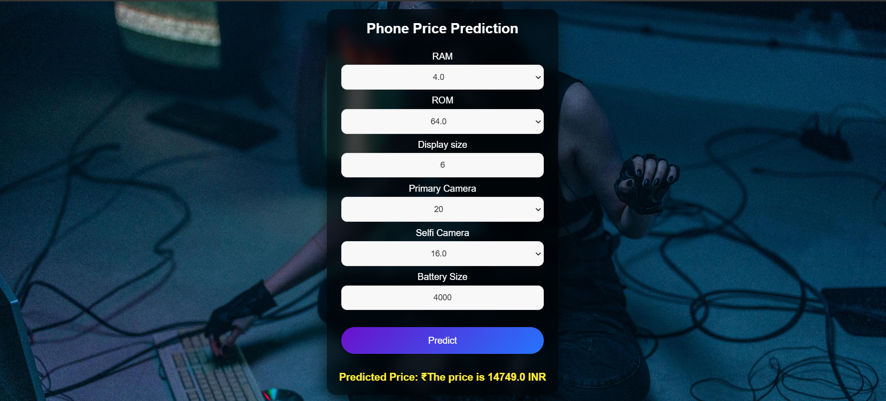

# Mobile Price Prediction



This project is a web-based application that predicts the price of a mobile phone based on its specifications such as RAM, ROM, Display Size, Camera Quality, and Battery Size. Users can input the mobile specifications, and the model will provide the predicted price.

## Features
- User-friendly interface to input mobile specifications.
- Accurate price prediction based on machine learning models.
- Real-time feedback to users with the predicted price displayed on the screen.

## Tech Stack
- **Frontend**: HTML, CSS
- **Backend**: Flask (Python)
- **Machine Learning Model**: Decision Tree Regressor (sklearn)
- **Deployment**: Localhost / Cloud Platform

## Getting Started

### Prerequisites
Ensure you have the following installed:
- Python 3.8 or above
- Flask
- Scikit-learn
- Pandas

### Installation
1. Clone the repository:
   ```bash
   git clone https://github.com/your_username/mobile-price-prediction.git
   ```
2. Navigate to the project directory:
   ```bash
   cd mobile-price-prediction
   ```
3. Install the required dependencies:
   ```bash
   pip install -r requirements.txt
   ```

### Usage
1. Start the Flask server:
   ```bash
   python app.py
   ```
2. Open your web browser and go to:
   ```
   http://127.0.0.1:5000
   ```
3. Enter the mobile specifications and click **Predict** to see the price.

## Machine Learning Model
- The Decision Tree Regressor was trained on a dataset containing various mobile specifications and prices.
- Achieved an R² score of 0.8958 after hyperparameter tuning.

## Dataset
The dataset includes the following columns:
- **RAM**: Random Access Memory (in GB)
- **ROM**: Read-Only Memory (in GB)
- **Display Size**: Screen size (in inches)
- **Primary Camera**: Rear camera quality (in MP)
- **Selfie Camera**: Front camera quality (in MP)
- **Battery Size**: Battery capacity (in mAh)
- **Price**: Mobile phone price (in INR)

## How It Works
1. User inputs mobile specifications via the form.
2. The inputs are processed and sent to the backend.
3. The trained Decision Tree Regressor predicts the price based on the input features.
4. The predicted price is displayed to the user.

